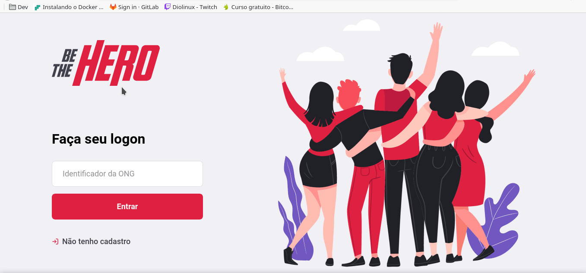

# **be the hero**
Projeto criado para centralizar informações de ongs e a pessoas que querem ajudá las, futuramente farei a implantação do projeto na digital ocean ou no heroku, para assim as pessoas da minha região poderem utilizalo.

O projeto foi desenvolvido dentro da semana omnistack 11, evento criado pelo pessoal da rocketseat.
Em relação a stack utilizada, o projeto foi desenvolvido apenas com javascript, do backend ao frontend, com express, celebrate e knex no backend, no frontend web com react e axios e no frontend mobile com expo, react-native e axios. A seguir será explicado a função de cada biblioteca/framework no desenvolvimento do projeto.

### **API REST** 

- **Express**: framework muito utilizado para desenvolvimento de aplicações backend com node, utilizei ele para tratar todas as rotas, requisições http ao backend, ele foi basicamente o núcleo da API REST do projeto, conectando os frontends a basicamente a camada de dados da aplicação.

- **Celebrate**: biblioteca utilizada para as validações as requisições a API.
- **Knex:** é uma biblioteca query builder, que atuou basicamente tratando de toda a comunicação e gerência de banco de dados sql, trazendo assim uma camada de abstração a parte de comunicação com o banco de dados e facilitando o desenvolvimento da persistência de dados da aplicação.

### **Interface Web** 

- **Reactjs:** framework base utilizado para a construção da interface web da aplicação.

- **Axios:** cliente http utilizado para comunicar a aplicação web react com o a API.
- **React-router-dom:** É basicamente um roteador, uma biblioteca que trata de receber requisições em urls específicas e saber como lidar com as requisições para essas urls, exemplo, em um sistema de cadastro de usuários que tem a url cad_user, o roteador é o responsável por saber o que fazer, para qual tela direcionar, ao chegar uma requisição para a aplicação a url cad_user.
Interface Mobile
### **Interface Mobile**
* **Axios:** mesmo propósito da outra aplicação.
* **React-native:** framework que provê a possibilidade de com javascript e a sintaxe jsx do react e reuso de vários de seus conceitos desenvolver a aplicação mobile multiplataforma do be the hero.

* **Expo:** framework que provê a possibilidade de desenvolvimento em react native sem necessitar da instalação das ferramentas de desenvolvimento nativo como o jdk, xcode, etc.
* **Expo-mail-composer:** biblioteca que provê envio de email dentro de aplicações react native do expo.
* **React-native-gesture-handler:** biblioteca usada para detectação de gestos do usuário como cliques em botões. 
* **React-navigation/native:** biblioteca que provê a navegação entre diferentes telas em aplicações para dispositivos móveis, existem muitos tipos de navegação, nessa aplicação foi utilizado a navegação em pilha, com basicamente duas telas, com a navegação indo da tela 1 para a 2 e vice versa.
### **Demonstração da aplicação Web**

### **Demonstração do app mobile**

